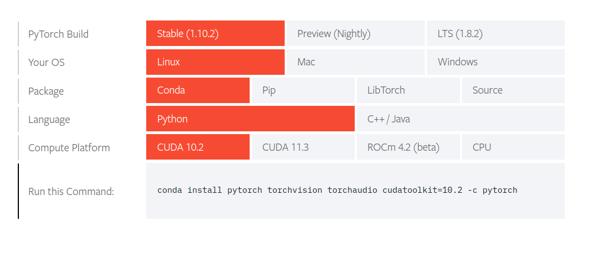

#  PyTorch 安装指南

官网：https://pytorch.org/

github安装指南: https://github.com/pytorch/pytorch#installation


- 二进制安装
  - pip
  - conda

- 源代码

- Docker 镜像


注：实验在ubuntu18.04系统上进行。

## 二进制安装

> 先须条件
>
> python >= 3.7
>  [glibc](https://www.gnu.org/software/libc/) >= v2.17
>  使用conda

检查python版本、pip版本
```sh
#检查python版本
python --version

pip --v运行ersion
#pip需要更新到最新版
pip install --upgrade pip
```


Anaconda

```sh
#安装minconda
curl -O https://repo.anaconda.com/miniconda/Miniconda3-latest-Linux-x86_64.sh
sh Miniconda3-latest-Linux-x86_64.sh
```


GPU支持

需要安装好CUDA


开始安装，点开官网选择对应的版本和安装方式。




/home/l/Deep_learning_environment/pictures

示例如下

```sh
#使用pip3 安装 支持CUDA10.2的torch
pip3 install torch torchvision torchaudio

#使用conda 安装
conda install pytorch torchvision torchaudio cudatoolkit=10.2 -c pytorch

```


测试

```sh
python3

>> import torch
>>
#可以正常导入torch
```


## 源代码安装

> If you are installing from source, you will need Python 3.7 or later and a C++14 compiler. Also, we highly recommend installing an [Anaconda](https://www.anaconda.com/distribution/#download-section) environment. You will get a high-quality BLAS library (MKL) and you get controlled dependency versions regardless of your Linux distro.

安装相关依赖

```sh
#安装依赖包
conda install astunparse numpy ninja pyyaml mkl mkl-include setuptools cmake cffi typing_extensions future six requests dataclasses

# CUDA only: Add LAPACK support for the GPU if needed
conda install -c pytorch magma-cuda110  # or the magma-cuda* that matches your CUDA version from https://anaconda.org/pytorch/repo

```


下载源码

```sh
git clone --recursive https://github.com/pytorch/pytorch
cd pytorch
# if you are updating an existing checkout
git submodule sync
git submodule update --init --recursive --jobs 0
```

安装

```sh
export CMAKE_PREFIX_PATH=${CONDA_PREFIX:-"$(dirname $(which conda))/../"}
python setup.py install
```


测试


## Docker 镜像

使用预先构建的镜像

```sh
#需要GPU支持，需提前安装好NVIDIA驱动和nvidia-docker
docker run --gpus all --rm -ti --ipc=host pytorch/pytorch:latest
```

>Please note that PyTorch uses shared memory to share data between processes, so if torch multiprocessing is used (e.g. for multithreaded data loaders) the default shared memory segment size that container runs with is not enough, and you should increase shared memory size either with `--ipc=host` or `--shm-size` command line options to `nvidia-docker run`.

#### 

创建自己的镜像

pytorch官方的github仓库里提供了用来构建镜像的Dockerfile文件

```sh
#下载源码后，使用make命令构建
make -f docker.Makefile
# images are tagged as docker.io/${your_docker_username}/pytorch
```


测试


